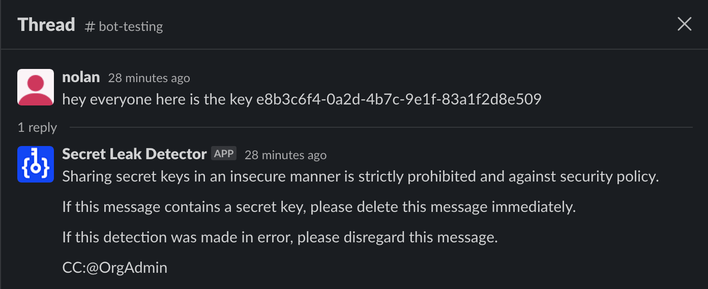

# Secret Leak Detection Bot

An AI-powered Slack bot that monitors channels for messages containing potential API keys or sensitive information and provides automated warnings to users.

## Table of Contents

- [Overview](#overview)
- [Features](#features)
- [Prerequisites](#prerequisites)
- [Installation](#installation)
- [Configuration](#configuration)
- [License](#license)

## Overview

This bot is designed to enhance security and compliance within Slack workspaces by automatically detecting messages that may contain API keys or other sensitive information. When such messages are identified, the bot provides warnings and alerts workspace admins to promote safe practices.

## Features

- Monitors Slack channels for messages containing potential API keys.
- Sends automated warnings when sensitive information is detected.
- Supports real-time detection using OpenAI's GPT-4 model.
- Promotes security awareness and compliance within Slack teams.

## Prerequisites

Before using this script, ensure you have the following prerequisites:

- Python is up to date on your system.
- Access to a Slack workspace where you can create and configure bots.
- Slack API credentials, including a bot token and signing secret.
- An OpenAI API key with access to the GPT-4 model.
- Python packages listed in the `requirements.txt` file installed.

## Installation

1. Clone this repository to your local machine:

    '''bash
   git clone https://github.com/NolanThompson/secret-leak-detector
   '''

2. Naviagte to the project directory:
    
    '''bash
    cd secret-leak-detector
    '''

3. Create a virtual environment (optional but recommended):

    '''bash
    python -m venv venv
    source venv/bin/activate
    '''

4. Install the required Python packages:

    '''bash
    pip install -r requirements.txt
    '''

## Configuration

1. Create a .env file in the project directory and configure it with the following environment variables:

    '''dotenv
    SLACK_TOKEN=your_slack_bot_token
    SIGNING_SECRET=your_slack_signing_secret
    CHATGPT_KEY=your_openai_api_key
    '''

2. Set up a Slack app in your workspace and obtain the bot token and signing secret.

3. Obtain an OpenAI API key with access to the GPT-4 model.

## License

This project is licensed under the [MIT License](https://github.com/git/git-scm.com/blob/main/MIT-LICENSE.txt)